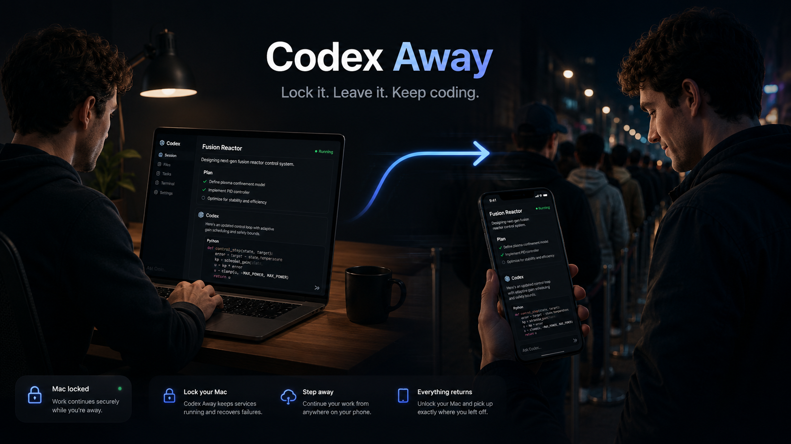

# Codex Away



**Lock it. Leave it. Keep coding.**

Codex Away automatically makes your Mac available through Codex Remote when
you step away.

Lock your Mac while it is plugged in and Codex Away enables Remote Control,
keeps the machine awake, monitors the managed services, and recovers from
process failures. Unlock the Mac or disconnect power and everything returns to
normal.

It is for people who occasionally want to continue their Codex work from an
iPhone without carrying a MacBook everywhere “just in case.”

> Leave your Mac behind without losing the ability to continue working from
> your phone.

## Why this exists

Codex Remote already provides conversations, approvals, authentication, and a
mobile interface. The remaining friction is preparing the Mac before leaving:

- enable Remote Control
- make sure the Mac stays awake
- leave it connected to power
- remember to undo everything after returning

Codex Away removes that preparation:

```text
Lock your Mac   = I might want it remotely.
Unlock your Mac = I am back.
```

That is the entire interaction model.

## How it behaves

```text
Working normally on Mac
          │
          ▼
  Lock Mac on AC power
          │
          ▼
     Codex Away
          │
          ├── Codex Remote on
          ├── Mac kept awake
          ├── services monitored
          └── failures recovered
          │
          ▼
Continue from phone while away
          │
          ▼
       Unlock Mac
          │
          ▼
Remote mode off; normal Mac again
```

If AC power is disconnected while the Mac is locked, Codex Away also turns
Remote Control and its sleep-prevention assertion off. Reconnecting AC while
the Mac remains locked makes the services available again.

## What Codex Away does

- Starts Codex Remote automatically when the Mac is locked on AC power.
- Keeps the Mac awake while remote mode is active.
- Stops remote mode when the Mac is unlocked or AC power is disconnected.
- Validates exact managed-process identity instead of trusting stale state.
- Detects required-process exits and performs bounded recovery.
- Uses exponential retry backoff to avoid restart storms.
- Runs periodic health audits while remote mode is desired.
- Reconstructs managed state after controller restarts.
- Avoids stopping unrelated Codex processes.
- Runs as a per-user, event-driven macOS LaunchAgent.
- Requires no custom phone application, relay, or session interface.

## Install

### Requirements

- macOS
- Xcode or Xcode Command Line Tools, including `swiftc`
- The standalone Codex installation managed by the official installer
- Codex Remote Control configured and tested at least once

The standalone Codex executable must exist at:

```text
~/.codex/packages/standalone/current/codex
```

If needed, install Codex with the official installer:

```sh
curl -fsSL https://chatgpt.com/codex/install.sh | sh
```

Then verify Remote Control manually:

```sh
codex remote-control start
codex remote-control stop
```

### Install the controller

Clone this repository and run:

```sh
./install.sh
```

The installer compiles the listener, installs it for the current user, and
starts its LaunchAgent automatically. Existing Codex Remote on Lock
installations are migrated in place: the legacy controller is unloaded, its
ownership and diagnostic state are preserved, and only the Codex Away
LaunchAgent remains active.

Installed paths:

```text
~/Library/Application Support/CodexAway/codex-away
~/Library/LaunchAgents/com.akibrhast.codex-away.plist
```

## Verify operation

Check that the listener is loaded:

```sh
launchctl print "gui/$(id -u)/com.akibrhast.codex-away"
```

Follow its activity log:

```sh
tail -f "$HOME/Library/Application Support/CodexAway/controller.log"
```

While connected to AC power, lock and unlock the Mac. The log should show a
sequence similar to:

```text
lock event received
remote control started
caffeinate started
unlock event received
remote control stopped
caffeinate stopped
```

Inspect active power assertions with:

```sh
pmset -g assertions
```

## Reliability

Codex Remote and `caffeinate -s` are managed through a shared service
lifecycle. Codex Away:

- serializes reconciliation so the newest lock and power state wins
- monitors exact validated service processes for exit
- checks required services with bounded health audits
- retries failures three times with exponential backoff
- cancels monitoring and pending recovery immediately on unlock or AC loss
- persists versioned ownership metadata
- safely re-adopts its exact `caffeinate` process after a controller restart

Its internal lifecycle is:

```text
OFF → STARTING → READY → RECOVERING
                      └→ ERROR
```

The primary locked + AC workflow passed automated and real-world acceptance
testing. See [Reliability acceptance testing](docs/reliability-testing.md) for
the results and [Observed state and ownership](docs/observed-state.md) for the
process-safety model.

## Known Codex limitation

### Active desktop conversations

Codex Remote can expose desktop conversations to the phone, but a conversation
still owned by a live desktop Codex worker may not be immediately resumable
remotely.

If you intend to continue the same terminal conversation from your phone,
release the terminal Codex session with `Ctrl+C` before locking the Mac. Codex
Away does not kill arbitrary Codex workers to force a handoff.

This is a limitation of the current Codex worker/session lifecycle rather than
the host-availability controller. The verified manual workflow and upstream
capability gap are documented in
[Live desktop thread handoff](docs/live-thread-handoff.md).

## Troubleshooting

### The listener does not start

Inspect the LaunchAgent error log:

```sh
cat "$HOME/Library/Application Support/CodexAway/launchd-error.log"
```

Reinstall after changing the source:

```sh
./install.sh
```

The installer rebuilds the listener, replaces the installed binary, and
reloads the LaunchAgent.

### A live desktop conversation fails to load remotely

If iOS displays `Error loading messages: Codex server returned an error`, but
the controller log says Remote Control started successfully, inspect:

```sh
tail "$HOME/.codex/app-server-daemon/app-server.stderr.log"
```

An `already has an active writer` error means the Mac is reachable but a live
desktop worker still owns that conversation. Start a new remote thread or
release the desktop session before locking. Do not kill arbitrary Codex
processes.

### Remote commands hang in Desktop or Downloads threads

macOS protects folders such as `Desktop` and `Downloads` with Files and Folders
privacy controls. A background Codex process may need permission before it can
resume a thread whose working directory is in one of those locations.

If the Mac is locked, the permission dialog is not visible remotely. Unlock the
Mac, approve the prompt, and verify the relevant access under **System Settings
→ Privacy & Security → Files and Folders**. Lock the Mac again and retry with a
fresh read-only command such as `pwd`.

Full Disk Access is broader than necessary and should not be granted unless the
narrower Files and Folders permission proves insufficient.

## Uninstall

Run:

```sh
./uninstall.sh
```

This unloads the LaunchAgent, stops Codex Remote Control, and removes the
installed executable and plist. Logs and state remain under
`~/Library/Application Support/CodexAway` for troubleshooting.

## Technical architecture

Codex Away deliberately does not build another Codex client, remote relay,
approval interface, SSH manager, tmux layer, or permanent development server.
OpenAI provides the remote experience; Codex Away manages whether the Mac is
ready to host it.

```text
macOS lock + power events
           │
           ▼
   machine state + policy
           │
           ▼
 serialized reconciliation
           │
           ├── Codex Remote lifecycle
           └── caffeinate lifecycle
```

The listener subscribes to macOS screen-lock, screen-unlock, session, and IOKit
power-source events. It reads the current lock and AC state at startup, then
waits for events rather than polling on a timer.

External commands run asynchronously with bounded output, cancellation, exit
status, and timeouts. Health checks keep observed process state separate from
controller ownership and reject missing, stale, reused, or mismatched process
identities.

## Development

The project is a Swift package:

```text
Sources/
├── RemoteDevCore/       State, policy, and policy evaluation
├── RemoteDevServices/   Managed services and system boundaries
└── RemoteDevDaemon/     macOS events and service control

Tests/
├── RemoteDevCoreTests/      Core policy tests
└── RemoteDevServicesTests/  Service and reconciliation tests
```

Run the test suite:

```sh
swift test
```

Build the release executable without installing it:

```sh
swift build --configuration release --product codex-away
```

Internal Swift target names remain unchanged. They do not affect the public
product identity.

## Security

- Codex Remote Control makes the Mac available only through devices authorized
  by the user's Codex account.
- Codex Away stores no Codex credentials, passwords, API keys, or private keys.
- The automation runs only for the macOS user who installs it.
- Exact identity and ownership checks prevent it from stopping unrelated Codex
  processes.
- Locking the screen does not replace FileVault, a strong login password, or
  secure account configuration.
- Codex currently labels `remote-control` experimental, so its behavior may
  change in future releases.

## Disclaimer

Codex Away is an independent utility and is not affiliated with or endorsed by
OpenAI.
