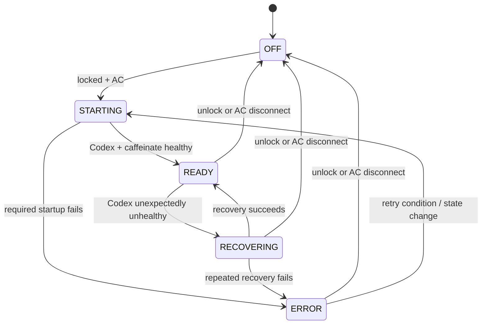
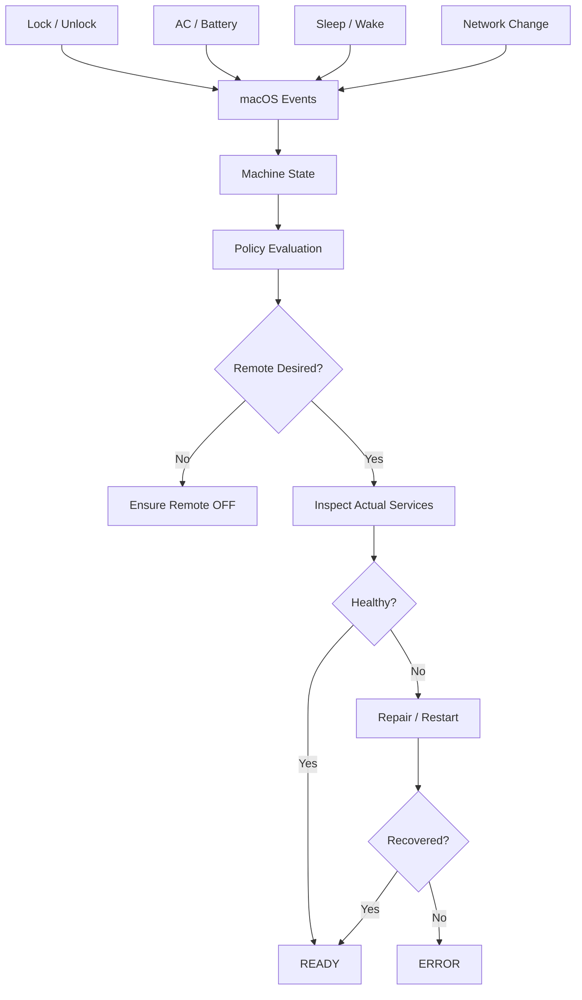

# Codex Remote on Lock Roadmap

This is the canonical and only active roadmap for the project. It supersedes
the earlier broad "Remote Dev Controller" plan.

## Project Goal

Build a small, reliable macOS utility that makes an everyday Mac automatically available through Codex Remote when the user steps away, without requiring them to remember to enable Remote Control manually or carry their MacBook "just in case."

The core experience should be:

```text
Working normally on Mac
        ↓
Lock Mac and leave
        ↓
Codex Remote automatically becomes available
Mac stays awake
        ↓
Open ChatGPT/Codex on iPhone
        ↓
Continue a desktop conversation that is not held by a live writer
        ↓
Return home and unlock Mac
        ↓
Remote mode turns off
Mac returns to normal behavior
```

The project is **not** intended to turn the Mac into a permanent development server.

It is intended to make an existing everyday Mac temporarily and reliably reachable whenever the user walks away.

---

# 1. Core User Problem

The recurring problem is not lack of remote-computing capability.

It is the friction around **unexpected small windows of time**.

Examples:

- leaving home while in the middle of a coding task
- driving into DC and waiting for someone
- standing in line late at night
- waiting at an appointment
- sitting in a coffee shop briefly
- meeting friends who are running late
- running errands and unexpectedly having 15–30 minutes free

Historically, the options were:

```text
Option A:
Bring the MacBook everywhere
```

This creates friction:

- carrying a laptop and charger
- unpacking it in awkward places
- opening a laptop in a line, bar, lobby, etc.
- turning on a mobile hotspot
- connecting the Mac to the hotspot
- asking cafés for Wi-Fi passwords
- dealing with captive portals
- often carrying the laptop and never using it

or:

```text
Option B:
Leave the Mac at home
```

Then later:

> "I have 20 minutes. I could have continued that task."

The intended solution:

```text
Leave Mac plugged in
Lock it
Walk away with phone
```

If free time appears later:

```text
Open iPhone
Open Codex conversation
Continue working
```

If no free time appears, nothing was carried unnecessarily.

---

# 2. What Codex Already Solves

Do not rebuild features Codex already provides.

Codex Remote / the iOS app already provides:

- access to conversations from the desktop machine
- chronological conversation listing
- continuation of existing desktop conversations
- reuse of the existing working directory and project context
- phone-based interaction with the coding agent

Therefore:

## Session discovery is solved; live-thread takeover is not.

Codex exposes desktop conversations remotely, but testing on Codex `0.147.0`
found that a conversation still owned by a live desktop worker can fail with a
thread-store `already has an active writer` conflict. Remote Control itself can
be healthy while that one conversation is unavailable.

See [docs/live-thread-handoff.md](docs/live-thread-handoff.md) for the observed
evidence and safety constraints.

This project does **not** need to build:

- its own conversation list
- project/session synchronization
- session databases
- custom context transfer
- custom conversation synchronization
- tmux-based session continuity

The project must make the host reliably available and, where Codex exposes safe
worker-lifecycle controls, make live desktop threads transferable without
interrupting active work.

---

# 3. Current Behavior

Current project behavior:

```text
Mac locked
AND
Mac on AC power
        ↓
codex remote-control start
caffeinate -s
```

When either condition becomes false:

```text
Mac unlocked
OR
AC disconnected
        ↓
codex remote-control stop
stop caffeinate
```

Current strengths:

- event-driven
- no lock-state polling loop
- LaunchAgent based
- native macOS lock/unlock notifications
- native IOKit power-source notifications
- simple reconciliation model
- user-level installation
- AC-only sleep prevention

This behavior should remain the foundation.

## Implemented Architecture

The repository has already completed four foundational milestones.

### Milestone 1 — Core state and policy (completed)

Commit: `1bdf86c`

- introduced the Swift package structure
- introduced `MachineState`, `RemoteDevPolicy`, and `ControllerMode`
- separated policy evaluation from macOS event handling
- preserved the original locked + AC behavior
- added policy unit tests

### Milestone 2 — Managed services (completed)

Commit: `d049cd1`

- introduced `ManagedService` and `ServiceHealth`
- extracted `CodexRemoteService` and `CaffeinateService`
- introduced injectable command, persistence, and process boundaries
- introduced ordered service reconciliation
- preserved Codex-first startup and controller-owned `caffeinate` shutdown
- added managed-service and reconciliation tests

Current test baseline:

```text
56 tests passing
```

These abstractions are retained because they directly support reliability.
They are not an invitation to add unrelated service integrations.

---

# 4. New Development Priorities

The new roadmap is intentionally much narrower than the earlier architecture plan.

Priority is determined by this question:

> "If I lock my Mac, leave home, and completely forget about this utility, will Codex still be available when I open my phone later?"

---

## Priority 1 — Make Lock → Remote Activation Extremely Reliable

Current intended rule:

```text
locked + AC
    ↓
remote mode ON
```

This remains the primary automatic behavior.

The utility should correctly handle repeated real-world sequences such as:

```text
lock
unlock
lock
unlock
lock
```

and:

```text
lock
AC disconnected
AC reconnected
unlock
lock
```

At the end of any sequence, the controller should always converge to the correct state.

### Required outcome

When:

```text
Mac is locked
AND
Mac is on AC
```

the desired state is:

```text
Codex Remote = ON
Stay Awake   = ON
```

When either condition becomes false:

```text
Codex Remote = OFF
Stay Awake   = OFF
```

---

## Priority 2 — Make Unlock → Normal Mac Behavior Equally Reliable

This is an everyday personal computer.

The utility should disappear when the user comes back.

On unlock:

```text
Codex Remote started by this utility → stop
caffeinate started by this utility   → stop
```

The project should not leave the Mac behaving like a permanent remote host.

The ideal experience:

```text
Away:
remote-capable workstation

Home:
normal Mac
```

No manual cleanup should be necessary.

---

## Priority 3 — Detect Actual Codex Remote State

The current state file is historical state:

```text
"on"
```

That means:

> "The controller successfully ran the start command."

It does not necessarily mean:

> "Codex Remote is still functioning right now."

This needs to change.

The controller should distinguish:

```text
Desired State
```

from:

```text
Observed State
```

Example:

```text
Desired:
Codex Remote = ON

Observed:
Codex Remote = OFF

Action:
restart Codex Remote
```

Persisted state should never be treated as definitive proof that a service is alive.

### Current Codex CLI constraint

As of Codex `0.147.0`, `codex remote-control` provides `start`, `stop`, and
`pair`, but no documented `status` command. Milestone 3 therefore began with a
discovery spike and tests rather than assuming a status API exists.

Candidate observed-state signals, in preferred order:

1. an authoritative machine-readable Codex-owned runtime artifact, if one can
   be identified and validated
2. an exact process-identity check for the Codex app-server daemon, including
   executable and arguments
3. the persisted controller state only as an ownership hint, never as proof

Do not use broad process-name matching or kill arbitrary Codex processes. The
Mac may have interactive Codex sessions and editor integrations running at the
same time.

---

## Priority 3A — Investigate Safe Live-Thread Handoff

Observed failure:

```text
Remote Control = healthy
desktop thread writer = still live
        ↓
iOS cannot load that thread
        ↓
thread-store conflict: already has an active writer
```

Investigate whether Codex exposes authoritative interfaces to:

1. map a live writer to its exact conversation
2. distinguish an executing/waiting turn from a genuinely idle worker
3. ask an idle worker to release its writer gracefully
4. verify that Remote Control can then resume the conversation

Lock remains the trigger for remote activation. Worker state is an additional
handoff-readiness check, not a replacement activation policy.

Safety rule:

> Preserve the worker unless both its identity and idle state are authoritative.

Never infer safety from quiet output, elapsed time, or a broad process-name
match. Never terminate a worker that is running, queued, awaiting approval,
waiting on a tool or subtask, or in an unknown state. If Codex provides no safe
inspection and graceful-release mechanism, document the limitation and do not
automate worker shutdown.

---

## Priority 4 — Self-Heal Codex Remote While the User Is Away

This is one of the highest-value improvements.

Failure scenario:

```text
11:00  Mac locked
11:00  Codex Remote starts
11:05  user leaves
11:22  Codex Remote dies
11:40  user opens iPhone
```

Current bad outcome:

```text
Remote access unavailable
User cannot fix it until returning home
```

Desired outcome:

```text
11:22  controller detects failure
11:22  controller restarts Codex Remote
11:23  health check passes
11:23  READY
```

The controller should automatically repair unexpected service failure while remote mode is desired.

### Recovery requirements

- detect stopped/broken Remote Control
- retry start
- avoid infinite rapid restart loops
- use backoff after repeated failure
- record failure/recovery in logs
- expose ERROR only after reasonable repair attempts fail

---

# 5. Add a Real Remote Mode Lifecycle

Replace binary thinking:

```text
ON / OFF
```

with:

```text
OFF
STARTING
READY
RECOVERING
ERROR
```

Suggested state machine:



Meaning:

### OFF

Remote mode is not desired.

### STARTING

Remote mode should be available and the controller is bringing services up.

### READY

Everything required for remote use is healthy.

### RECOVERING

Remote mode should be available, but the controller detected a problem and is repairing it.

### ERROR

Remote mode is desired but the controller cannot currently make it healthy.

---

# 6. Keep the Mac Awake Reliably

The existing `caffeinate -s` behavior remains useful.

Goal:

```text
Remote mode desired
AND
AC power
        ↓
prevent system sleep
```

The display does not need to remain on.

The laptop should remain usable remotely without changing permanent macOS sleep preferences.

### Important

The controller should verify that the sleep-prevention process it started is still alive.

Do not assume an in-memory `Process` reference is sufficient forever.

---

# 7. Sleep / Wake Recovery

Because this is a daily-use Mac, sleep/wake behavior is more important than server features.

On wake, assume previous runtime knowledge may be stale.

Use:

```text
WAKE
 ↓
refresh lock state
refresh AC state
refresh network availability
inspect Codex Remote
inspect caffeinate
 ↓
reconcile
```

Principle:

> Wake means audit reality again.

Do not merely continue from the controller's previous assumptions.

### Desired behavior

If the machine wakes and is:

```text
locked + AC
```

remote mode should converge back to:

```text
READY
```

If it wakes and is:

```text
unlocked
```

remote mode should converge to:

```text
OFF
```

---

# 8. Network Loss / Recovery

Do not build trusted-network policy yet.

The current useful distinction is simply:

```text
network available
network unavailable
```

Scenario:

```text
Mac locked
Remote Ready
Wi-Fi temporarily disappears
Wi-Fi comes back
```

When connectivity changes back to available:

```text
refresh state
inspect Codex
reconcile
verify READY
```

The goal includes recovery from ordinary network interruptions and explicitly
tracks captive-portal sessions as a separate failure mode.

### Captive-portal idle-session edge case

Real scenario: the Mac is left locked at a dedicated library seat on a guest
network such as UVA Guest while the user leaves for several hours. The guest
portal may expire or sign out an idle session before the user attempts to
connect from a phone. The Mac can remain associated with Wi-Fi while no longer
having usable internet access, making Remote Control unreachable.

Milestone 8 must not equate Wi-Fi association with network availability. It
must investigate and distinguish:

- Wi-Fi disconnected
- Wi-Fi associated with working internet access
- Wi-Fi associated but blocked by a captive portal or expired guest session
- connectivity restored without user interaction
- connectivity requiring interactive portal reauthentication

The design should determine whether a policy-compliant, low-frequency activity
check can prevent an idle portal session from expiring. It must not assume that
automated portal reauthentication is possible or appropriate. If human portal
interaction is required after expiry, the controller must report that as an
unrecoverable remote-access condition rather than repeatedly restarting Codex.

### Not currently needed

- home vs coffee-shop network profiles
- SSID allowlists
- VPN rules
- location-aware remote policies

These can be reconsidered only if a real need appears.

---

# 9. Async Process Execution + Timeouts

The current implementation can wait synchronously for subprocesses.

This becomes dangerous once health checks and recovery are added.

A hung Codex command should not freeze lock/unlock/power event handling.

Target architecture:

```text
macOS events
     ↓
Machine State
     ↓
Reconciliation task / actor
     ↓
Codex commands with timeout
```

Every external command should eventually support:

- timeout
- cancellation
- exit status
- stdout/stderr capture
- clear failure reason

Example:

```text
codex start timeout: 10s
codex stop timeout: 10s
health check timeout: 5s
```

---

# 10. Minimal Machine State Model

Keep the abstraction, but keep it small.

Initial target:

```swift
struct MachineState {
    var isLocked: Bool
    var isOnACPower: Bool
    var networkAvailable: Bool
}
```

Potential later addition:

```swift
var isSleeping: Bool
```

Do not prematurely add:

- lid position
- location
- trusted SSID
- elaborate idle policies

unless testing proves they are necessary.

---

# 11. Minimal Policy Model

Keep policy simple:

```swift
struct RemotePolicy {
    var requireLocked: Bool = true
    var requireACPower: Bool = true
}
```

Automatic desired state:

```text
requireLocked satisfied
AND
requireACPower satisfied
        ↓
Remote Mode Desired
```

This abstraction exists primarily to keep event handling separate from business logic.

Do not turn this into a large rules engine.

---

# 12. Recommended Internal Architecture



ASCII version:

```text
OS events
   │
   ▼
MachineState
   │
   ▼
Policy
   │
   ▼
Desired remote state
   │
   ├── OFF → stop controller-owned services
   │
   └── ON
        │
        ▼
   inspect reality
        │
   ┌────┴────┐
 healthy   broken
   │          │
 READY      recover
              │
        ┌─────┴─────┐
      fixed        failed
        │             │
      READY          ERROR
```

---

# 13. Service Scope

For now, only two managed services exist.

## Codex Remote

Responsibilities:

- detect actual state
- start
- stop
- verify health
- recover unexpected failure

## Sleep Prevention

Responsibilities:

- start `caffeinate -s`
- verify process still exists
- stop only the instance owned by this controller

That is enough.

---

# 14. What We Are Explicitly Cancelling

The previous roadmap included several ideas that no longer align with the actual personal use case.

These are removed from the active plan.

---

## CANCELLED — SSH Fallback

Previous idea:

```text
Codex Remote fails
   ↓
SSH into Mac
   ↓
repair it manually
```

Reason for removal:

This Mac is an everyday personal computer, not a dedicated server.

The preferred solution is:

```text
Codex Remote fails
   ↓
controller repairs it automatically
```

Self-healing is much more aligned with the goal than maintaining a secondary remote-access stack.

Status:

```text
CANCELLED / NOT PLANNED
```

Can be reconsidered only if self-healing proves insufficient in real usage.

---

## CANCELLED — tmux Session Management

Previous idea:

- automatically create tmux sessions
- preserve development terminals
- attach remotely through SSH

Reason for removal:

Codex exposes desktop conversations in the iOS app. A live-writer conflict can
prevent immediate takeover of one conversation, but tmux does not solve that
Codex persistence-ownership problem.

Status:

```text
CANCELLED
```

---

## CANCELLED — Project Session Synchronization

Previous idea:

- track active project
- track current Codex conversation
- recreate work context
- build session handoff logic

Reason for removal:

Codex already provides chronological access to desktop conversations from iOS.
The project should investigate safe release of an idle live writer, but should
not build its own session database or context-transfer system.

Status:

```text
CANCELLED
```

---

## CANCELLED — Docker / Postgres / Redis Auto-Startup

Previous idea:

```text
Remote mode
  ↓
start full development environment
```

Reason for removal:

This machine is already actively used throughout the day.

The utility should not become a general development-environment orchestrator.

Codex should operate against whatever environment the user was already using.

Status:

```text
CANCELLED FOR CURRENT SCOPE
```

---

## CANCELLED — Dedicated Remote Development Server Model

Previous direction:

> Turn the Mac into a remote development appliance.

New direction:

> Make the user's normal Mac seamlessly available through Codex when they step away.

This is a significant scope correction.

Status:

```text
CANCELLED AS PRODUCT ARCHITECTURE
```

---

## DEFERRED — Trusted Network Policies

Previous idea:

```text
Home Wi-Fi → enable
Hotel Wi-Fi → limited
Unknown Wi-Fi → disable
```

Reason for deferral:

The current Mac normally remains at home while the user is away.

Network reliability matters; network classification does not.

Status:

```text
DEFERRED
```

---

## DEFERRED — Idle-Based Activation

Previous idea:

```text
idle > 10 min
→ remote mode
```

Reason for deferral:

Locking the Mac is already an excellent and explicit "I am away" signal.

Idle activation may create false positives during movies, reading, long builds, gaming pauses, etc.

Status:

```text
DEFERRED / PROBABLY UNNECESSARY
```

---

## DEFERRED — "I'm Leaving" Mode

Previous product idea:

```text
Enable for 4 hours
Enable until tonight
```

Reason for deferral:

The strongest version of the personal workflow requires no preparation.

The user should not have to remember:

> "I'm leaving, therefore I should enable something."

Locking the Mac should be sufficient.

Temporary overrides may be useful later, but they are not a core requirement.

Status:

```text
DEFERRED
```

---

## DEFERRED — Menu-Bar UI

A menu-bar UI remains potentially useful, but it is not a current engineering priority.

Reason:

A polished status display is meaningless if the underlying daemon cannot be trusted.

First make this true:

```text
lock Mac
leave
forget utility exists
open iPhone later
Codex works
```

Then build UI.

Status:

```text
DEFERRED UNTIL RELIABILITY IS PROVEN
```

---

## DEFERRED — CLI / Doctor

A CLI and `doctor` command are still good ideas for troubleshooting.

However, they come after:

- real Codex state detection
- self-healing
- wake recovery
- network recovery
- process timeouts

Status:

```text
DEFERRED, NOT CANCELLED
```

---

# 15. Authoritative Milestone Order

Every milestone follows the same delivery gate:

```text
inspect current state
    ↓
write a detailed implementation and verification plan
    ↓
obtain user confirmation
    ↓
implement, test, review, and commit
```

No later milestone starts automatically.

## Milestone 1 — Core State and Policy — COMPLETED

Delivered in `1bdf86c`:

- minimal `MachineState`
- minimal `RemoteDevPolicy`
- `ControllerMode`
- pure policy evaluation
- locked + AC behavior preserved
- policy tests

Success achieved:

```text
No user-visible behavioral change.
```

---

## Milestone 2 — Managed Services — COMPLETED

Delivered in `d049cd1`:

- `ManagedService` abstraction
- `ServiceHealth`
- `CodexRemoteService`
- `CaffeinateService`
- ordered generic reconciliation
- injectable system boundaries
- service and reconciliation tests

Milestone 2 limitation, resolved by Milestone 3:

```text
Codex health still reflects the historical state file.
caffeinate health still reflects the current in-memory Process object.
```

---

## Milestone 3 — Real Observed State — COMPLETED

The discovery spike confirmed that the installed Codex CLI has no documented
`remote-control status` command. Observed state therefore uses Codex-owned
runtime metadata plus exact kernel process identity.

- validates `remoteControlEnabled`, Codex PID metadata, executable, arguments,
  and process start time
- separates observed health from controller ownership
- treats the historical `"on"` state only as a migrated ownership hint
- persists versioned service ownership metadata atomically
- records and validates PID, executable, arguments, and start identity
- re-adopts an exact controller-owned `caffeinate` after controller restart
- rejects missing, stale, reused, or mismatched PIDs without signaling them
- never treats interactive or editor Codex processes as Remote Control
- documents Codex 0.147.0 runtime assumptions in `docs/observed-state.md`
- adds process, persistence, migration, runtime-fixture, and ownership tests

Retries, backoff, periodic monitoring, and process-exit recovery remain outside
this milestone.

Success:

```text
The controller can restart and accurately determine whether each managed
service is actually running without confusing unrelated processes for its own.
```

---

## Milestone 4 — Async Commands and Timeouts — COMPLETED

- moved external command execution away from the main event loop
- added a serialized, latest-state-wins reconciliation coordinator
- added command timeout, cancellation, graceful termination, and forced cleanup
- captures exit status and separately bounded stdout/stderr
- made initial and delayed lock-state reads reject stale results by revision
- made `ioreg`, Codex Remote commands, and caffeinate shutdown asynchronous
- added command-runner and reconciliation race tests

Retries, backoff, periodic monitoring, and automatic process-exit recovery remain
outside this milestone.

Success:

```text
No external command can freeze lock/unlock/power event processing, and stale
startup work cannot leave remote mode enabled after policy becomes false.
```

---

## Investigation — Idle-Worker Release for Live Handoff

This is a gated discovery task, not yet an implementation milestone.

- reproduce the active-writer conflict with controlled desktop thread states
- determine whether Codex exposes authoritative per-thread turn/worker state
- determine whether Codex exposes a supported graceful writer-release action
- distinguish idle from running, queued, approval-waiting, tool-waiting,
  subtask-waiting, and unknown states
- verify that releasing one idle writer does not affect other Codex sessions
- verify that the same thread becomes loadable through Remote Control
- stop the investigation without automation if safe state or release controls
  are unavailable

Only after the discovery evidence and design receive user confirmation should
this become an implementation milestone.

Success threshold:

```text
An exact, verifiably idle desktop thread writer can be released gracefully and
the same conversation can then be resumed remotely, without interrupting any
active or uncertain worker.
```

---

## Milestone 5 — Remote Lifecycle State

Implement and derive:

```text
OFF
STARTING
READY
RECOVERING
ERROR
```

- compute overall status from desired state plus required-service health
- record the latest transition reason and failure
- keep state internal until a later CLI or UI needs it
- add transition-table tests

Success:

```text
Controller status accurately represents desired and observed reality.
```

---

## Milestone 6 — Self-Healing Reconciliation

- detect when Codex exits while remote mode remains desired
- prefer an event-driven process-exit signal when reliable
- use a bounded health audit only if Codex exposes no dependable event source
- restart unhealthy required services
- add retry limits and exponential backoff
- reset recovery counters after stable health or policy change
- avoid restart storms
- log recovery attempts and outcomes
- stop recovery immediately after unlock or AC disconnect

Success:

```text
Killing Codex Remote while the Mac is locked causes a bounded transition from
READY to RECOVERING and back to READY without user intervention.
```

---

## Milestone 7 — Sleep / Wake Recovery

- subscribe to relevant macOS sleep/wake events
- invalidate stale runtime assumptions before sleep
- fully refresh lock and AC state after wake
- inspect actual managed services
- reconcile from observed reality

Success:

```text
Sleep/wake does not strand remote access or leave remote mode running after the
user returns.
```

---

## Milestone 8 — Network Recovery

- add network availability to `MachineState`
- detect connectivity loss and restoration
- trigger inspection and reconciliation when connectivity returns
- detect usable internet connectivity rather than relying only on Wi-Fi link
  state
- distinguish captive-portal or expired-session failures from ordinary network
  loss
- investigate policy-compliant idle-session prevention for guest networks,
  including the UVA Guest library scenario
- avoid restart loops when portal reauthentication requires local interaction
- avoid SSID allowlists, location policy, or VPN orchestration
- determine through testing whether network loss should mean ERROR or a
  distinct non-ready condition

Success:

```text
Ordinary network interruptions recover without user intervention, while an
expired captive-portal session is detected and handled without a restart storm.
```

---

## Milestone 9 — Reliability Testing

Run deliberate failure tests.

### Test A

```text
lock Mac
verify READY
kill Codex Remote
verify RECOVERING
verify READY
```

### Test B

```text
lock Mac
disconnect AC
verify OFF
reconnect AC
verify READY
```

### Test C

```text
lock
unlock
lock
unlock
lock
verify correct final state
```

### Test D

```text
lock Mac
sleep/wake
verify final state
```

### Test E

```text
lock Mac
interrupt network
restore network
verify recovery
```

### Test F

```text
lock Mac
restart controller daemon
verify observed state reconstruction
```

Also verify:

- the controller never stops unrelated Codex processes
- a stale or reused PID is rejected
- repeated failures do not produce a restart storm
- unlock and AC disconnect cancel pending recovery
- the LaunchAgent can restart the controller without losing ownership safety

Success:

```text
The acceptance workflow remains reliable across ordinary lifecycle changes and
deliberately induced failures.
```

---

# 16. Acceptance Test

The project is successful when the following behavior becomes boring and trustworthy:

```text
1. Work normally on Mac.

2. Lock Mac.

3. Leave home.

4. Do not check the daemon.
   Do not check Codex.
   Do not prepare anything else.

5. Hours later, get unexpected downtime.

6. Open the iPhone.

7. See desktop Codex conversations.

8. Continue the conversation that was already in progress, provided its live
   desktop writer has been safely released; otherwise use a new remote thread.

9. Return home.

10. Unlock Mac.

11. Continue using the Mac normally.
```

The utility should be invisible during normal use.

If the user feels the need to check:

> "Is Remote Control definitely running before I leave?"

then reliability work is not finished.

---

# 17. Scope Philosophy

Use this rule for future feature decisions:

> Does this make "lock Mac → leave → continue from iPhone later" more reliable or more effortless?

If yes:

```text
consider it
```

If no:

```text
probably do not build it
```

This intentionally rejects the tendency to turn the project into:

- a server manager
- a dev environment manager
- a remote shell product
- a session manager
- a Docker orchestrator
- a generic automation platform

The project should remain small.

---

# 18. Product / Commercial Track

Commercialization ideas are intentionally **paused**, not discarded.

Pinned for later:

- micro-utility positioning
- "$0.99–$2.99 for convenience" concept
- "Leave the MacBook. Keep coding."
- "Lock it. Leave it. Keep coding."
- paid-vs-free packaging
- App Store / direct-sale possibilities
- A/B landing-page testing
- objections such as:
  - "Why not leave Codex running?"
  - "Why not keep the Mac awake?"
  - "Why not turn Remote Control on manually?"
  - "Why not bring the MacBook?"
- lifestyle pitch vs automation pitch

Do not optimize development around selling the app yet.

First build something the author genuinely trusts and uses.

The strongest future product evidence will be:

> "I built this because I repeatedly needed it, and eventually stopped carrying my MacBook just in case."

---

# 19. Current North Star

```text
            ACTIVE WORK ON MAC
                    │
                    │ lock
                    ▼
            REMOTE MODE READY
                    │
                    │ leave home
                    ▼
          PHONE BECOMES CONTROL SURFACE
                    │
                    │ existing Codex conversation
                    ▼
              CONTINUE WORKING
                    │
                    │ return + unlock
                    ▼
             NORMAL MAC AGAIN
```

The compute stays on the Mac.

The repository stays on the Mac.

The Codex conversation stays on the Mac.

The user moves.

The utility's job is simply to make that transition reliable enough that the user no longer has to think about it.
