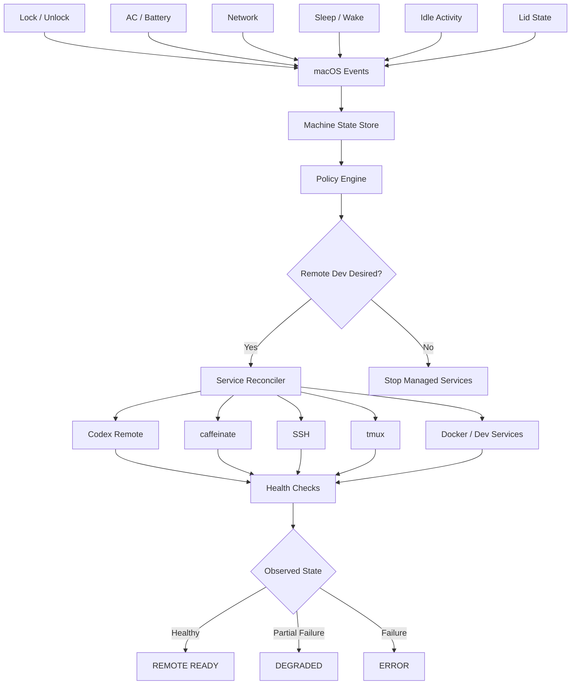
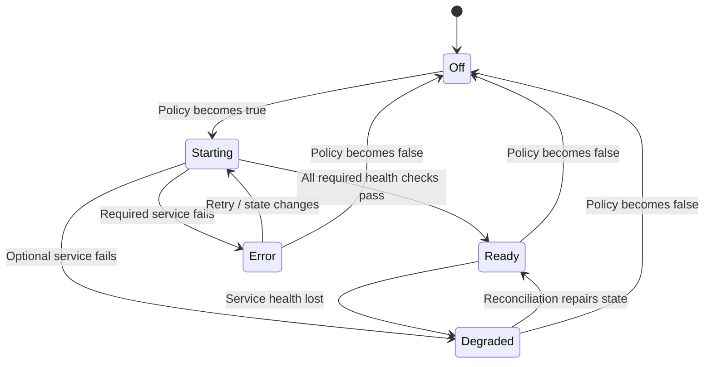
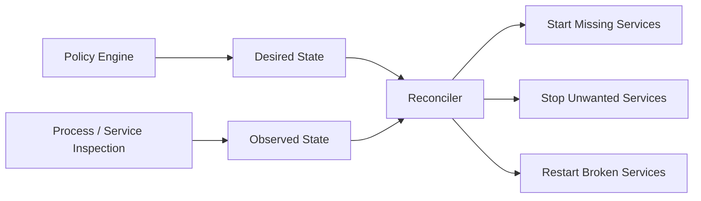
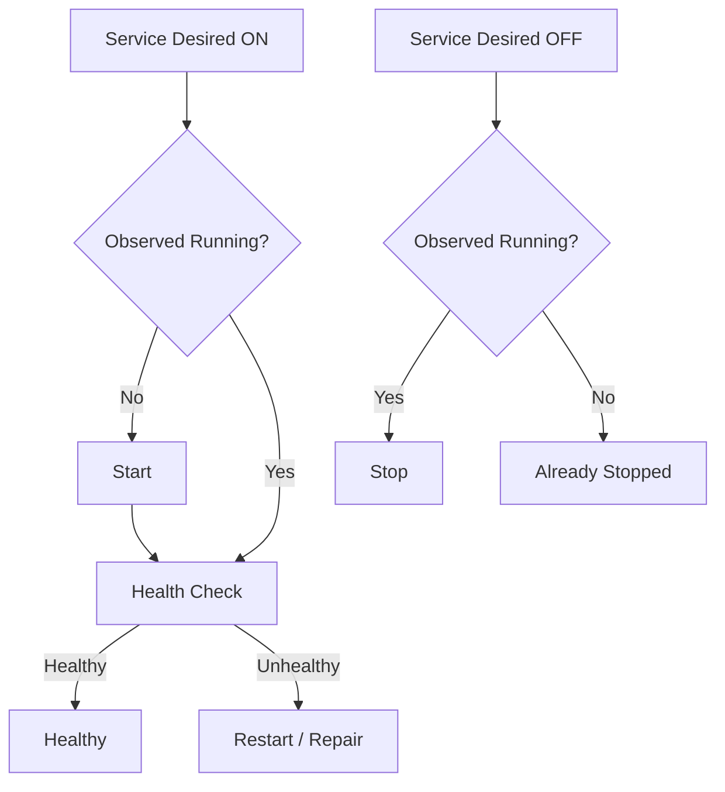
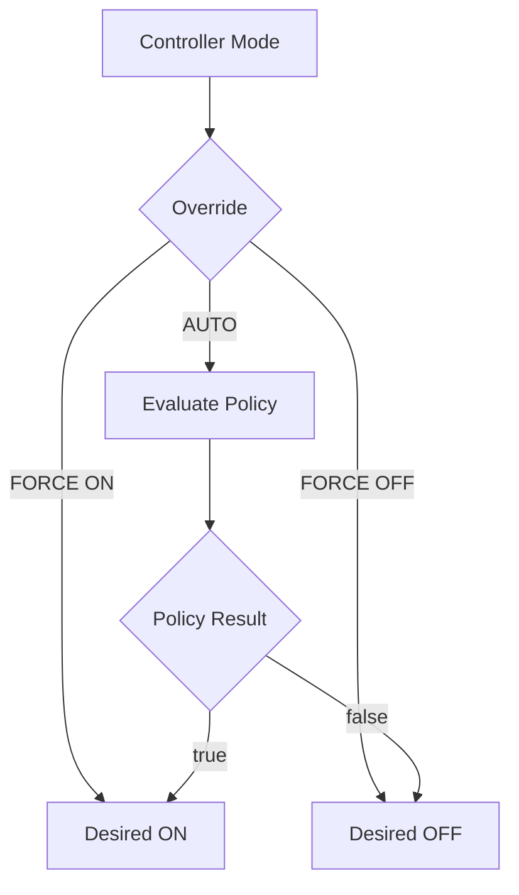
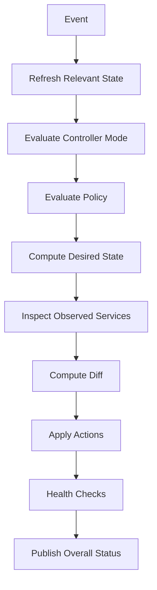
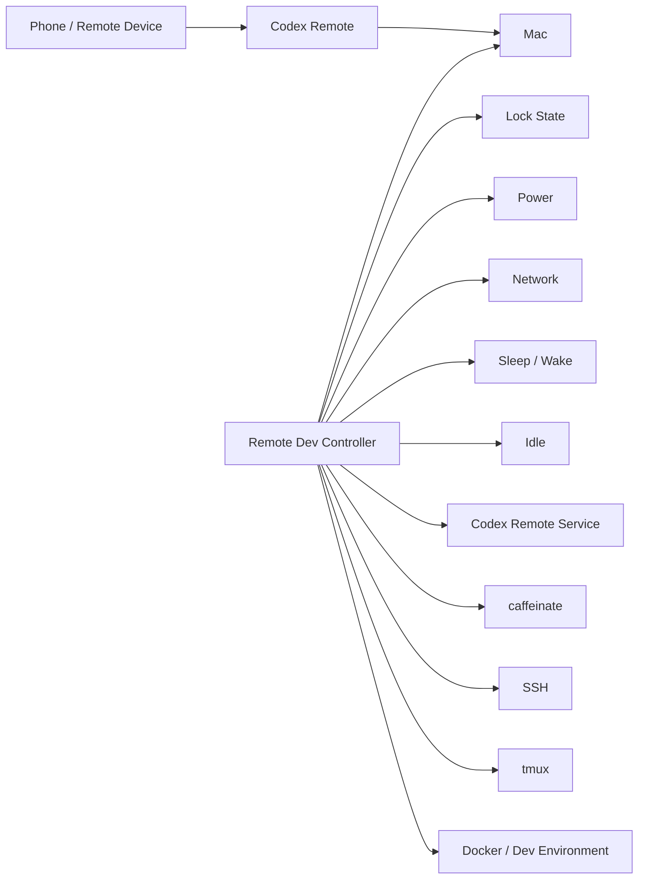

# Codex Remote on Lock → Remote Dev Controller

**Repository:** https://github.com/akibrhast/codex-remote-on-lock  
**Goal:** Evolve the current macOS lock-trigger utility into a secure, event-driven, self-healing remote development controller.

---

## 1. Executive Summary

The current project is already more than a simple "run Codex when my Mac locks" script.

At its core, it is an **event-driven policy controller**:

```text
macOS events
   │
   ├── screen locked/unlocked
   ├── user session active/inactive
   └── AC power connected/disconnected
            │
            ▼
       reconcile()
            │
      condition satisfied?
       locked && AC
        /        \
      yes         no
       │           │
       ▼           ▼
Codex Remote    Stop Remote
caffeinate      Stop caffeinate
```

That architecture is the most valuable part of the project.

The best direction is not to replace Codex Remote. Instead, build the missing **host-management layer** around it:

> Codex handles the coding work.  
> This project makes sure the Mac is safely, reliably, and automatically ready for remote coding.

The end-state can be thought of as a lightweight macOS equivalent of a service controller:

```text
                    Remote Dev Controller
                            │
               ┌────────────┼─────────────┐
               │            │             │
               ▼            ▼             ▼
          Access Layer   Machine State   Dev Environment
               │            │             │
               │         lock/unlock      │
               │         power            │
               │         network          │
               │         idle             │
               │         sleep/wake       │
               │                          │
               ▼                          ▼
          Codex Remote                tmux / Docker
          SSH fallback                repos / services
          future tools                status checks
```

---

# 2. What the Current Repository Already Does Well

Repository files:

- `CodexRemoteOnLock.swift`
- `README.md`
- `install.sh`
- `uninstall.sh`
- `com.openai.codex.remote-on-lock.plist.template`

Repository URL:

https://github.com/akibrhast/codex-remote-on-lock

## 2.1 Event-driven instead of polling

The Swift daemon listens to native macOS events using:

- `DistributedNotificationCenter`
- `NSWorkspace`
- IOKit power-source notifications

That is significantly better than:

```text
every 5 seconds:
    check if locked
    check if plugged in
```

The current model is:

```text
EVENT
  ↓
update machine state
  ↓
reconcile desired behavior
```

That should remain the architectural backbone.

---

## 2.2 Centralized reconciliation

The most important function is conceptually:

```swift
private func reconcile(reason: String) {
    if locked && Self.isOnACPower() {
        startManagedServices(reason: reason)
    } else {
        stopManagedServices(reason: reason)
    }
}
```

This is a good design because event handlers do not independently decide what to do.

Bad pattern:

```text
onLock() → start Codex
onPowerConnected() → maybe start Codex
onUnlock() → stop Codex
onPowerDisconnected() → stop Codex
```

Better pattern, which the project already uses:

```text
events
   ↓
machine state
   ↓
single policy decision
   ↓
desired state
```

This is structurally similar to a controller/reconciliation model used by systems such as Kubernetes.

---

## 2.3 LaunchAgent is the right execution model

The project installs a LaunchAgent for the current macOS user.

That gives you:

- start at login
- no root requirement
- persistent background execution
- integration with the user GUI session
- access to macOS user-session notifications

That is appropriate for this project.

---

## 2.4 `caffeinate -s` is a sensible power choice

The current project uses:

```bash
caffeinate -s
```

This is a good choice because it prevents system sleep while on AC power without unnecessarily forcing the display to stay awake.

The current policy:

```text
locked AND AC power
    ↓
Codex Remote ON
caffeinate ON
```

is conservative and sensible for a laptop.

---

# 3. Recommended Product Direction

The current name describes an implementation detail:

> Codex Remote on Lock

The larger concept is:

> Remote Dev Mode for macOS

or internally:

```text
remote-devd
```

Potential repo/product naming:

- `remote-devd`
- `mac-remote-dev`
- `remote-dev-controller`
- `codex-host-controller`
- keep current repo name but introduce a larger internal architecture

The important shift is conceptual:

```text
CURRENT

lock + AC
   ↓
start Codex
```

becomes:

```text
FUTURE

machine state
   ↓
policy engine
   ↓
desired remote-dev state
   ↓
service reconciliation
   ↓
health validation
   ↓
READY / DEGRADED / ERROR
```

---

# 4. Target Architecture



Equivalent ASCII version:

```text
                  ┌─────────────────────┐
                  │    Event Sources    │
                  ├─────────────────────┤
                  │ Lock / Unlock       │
                  │ AC Power            │
                  │ Network             │
                  │ Lid state           │
                  │ Sleep / Wake        │
                  │ Idle time           │
                  └──────────┬──────────┘
                             │
                             ▼
                    ┌────────────────┐
                    │ Machine State  │
                    └────────┬───────┘
                             │
                             ▼
                    ┌────────────────┐
                    │ Policy Engine  │
                    └────────┬───────┘
                             │
                             ▼
                   desired remote state
                             │
                             ▼
                   ┌──────────────────┐
                   │ Service Manager  │
                   └────────┬─────────┘
                            │
            ┌───────────────┼────────────────┐
            ▼               ▼                ▼
      Codex Remote       caffeinate       SSH / tmux
            │               │                │
            └───────────────┼────────────────┘
                            ▼
                      Health Checks
                            │
                            ▼
                  READY / DEGRADED / ERROR
```

---

# 5. Phase 1 — Introduce a Real Machine State Model

Today the core condition is:

```swift
locked && Self.isOnACPower()
```

Replace this with explicit state.

Example:

```swift
struct MachineState {
    var locked: Bool
    var onACPower: Bool
    var networkAvailable: Bool
    var trustedNetwork: Bool
    var lidClosed: Bool
    var sleeping: Bool
    var idleSeconds: TimeInterval
}
```

Then define policy independently:

```swift
struct RemoteDevPolicy {
    var requireLocked: Bool
    var requireACPower: Bool
    var requireNetwork: Bool
    var requireTrustedNetwork: Bool
    var minimumIdleSeconds: TimeInterval?
}
```

Evaluation:

```swift
func shouldEnableRemoteDev(
    state: MachineState,
    policy: RemoteDevPolicy
) -> Bool
```

Example configuration:

```yaml
remoteMode:
  require:
    locked: true
    acPower: true
    network: true

  services:
    codexRemote: true
    preventSleep: true
```

## Why this matters

Once state and policy are separated, adding future triggers becomes easy.

For example:

```text
Policy A:
locked + AC

Policy B:
idle 10 min + AC

Policy C:
AC + trusted home network

Policy D:
manual override
```

No service code needs to know why remote mode was enabled.

---

# 6. Phase 2 — Replace "Command Succeeded" with "Remote Ready"

The current state file stores something equivalent to:

```text
on
```

But that only means:

> the start command returned success.

It does not prove that the machine is actually usable remotely.

The project README already documents a real failure mode where macOS privacy permissions can cause remote commands to hang even while Remote Control itself appears active.

Introduce explicit lifecycle states:

```swift
enum RemoteDevStatus {
    case off
    case starting
    case ready
    case degraded
    case error
}
```

State diagram:



Example log:

```text
2026-08-17T01:12:31Z remote mode requested
2026-08-17T01:12:32Z codex remote started
2026-08-17T01:12:32Z caffeinate started pid=4128
2026-08-17T01:12:34Z codex health check passed
2026-08-17T01:12:34Z REMOTE READY
```

---

# 7. Phase 3 — Desired State vs Observed State

This is one of the most important architectural upgrades.

Current thinking:

```text
state file says ON
therefore service is ON
```

Future thinking:

```text
Desired state:
    Codex = ON
    caffeinate = ON

Observed state:
    Codex = OFF
    caffeinate = ON

Reconciler:
    start Codex
```

Diagram:



Why this matters:

Imagine:

```text
1. Mac locks
2. Remote mode starts
3. caffeinate starts
4. controller crashes
5. launchd restarts controller
```

The new controller process has lost its original `Process` object.

But the actual child process may still exist.

Therefore an in-memory reference is not a reliable source of truth.

---

# 8. Phase 4 — Managed Service Abstraction

Instead of hardcoding everything inside:

```swift
startManagedServices()
stopManagedServices()
```

create a common interface.

Example:

```swift
protocol ManagedService {
    var name: String { get }
    var required: Bool { get }

    func status() async -> ServiceStatus
    func start() async throws
    func stop() async throws
}
```

Possible implementation types:

```text
CodexRemoteService
CaffeinateService
SSHService
TmuxService
DockerService
CustomCommandService
```

Service lifecycle:



Now your main controller can do:

```swift
for service in configuredServices {
    await reconcile(service)
}
```

---

# 9. Phase 5 — Make Reconciliation Asynchronous

The current implementation runs commands synchronously and waits for them:

```swift
try process.run()
process.waitUntilExit()
```

The macOS notifications arrive on the main queue.

That means a hung subprocess can stall your controller's event loop.

Future model:

```text
macOS notifications
      │
      ▼
MachineState Store
      │
      ▼
Reconciliation Actor
      │
      ├── service commands
      ├── timeouts
      ├── retries
      └── health checks
```

Recommended Swift structure:

```swift
actor Reconciler {
    func reconcile(
        machineState: MachineState,
        policy: RemoteDevPolicy
    ) async {
        // compare desired / observed state
    }
}
```

Use `async/await`.

Each process execution should support:

- timeout
- cancellation
- captured output
- termination
- structured error reporting

Example:

```text
Codex start timeout: 10 seconds
Codex health timeout: 5 seconds
Caffeinate start timeout: 3 seconds
```

---

# 10. Phase 6 — Self-Healing Behavior

The controller should continuously converge reality toward the desired state.

Example:

```text
Desired:
    remote mode ON

Observed:
    Codex Remote stopped unexpectedly

Action:
    restart Codex Remote
```

Possible recovery strategy:

```text
failure #1 → retry immediately
failure #2 → retry after 2 sec
failure #3 → retry after 5 sec
failure #4 → retry after 15 sec
failure #5 → mark DEGRADED
```

Add rate limiting so the daemon never enters a restart storm.

Example:

```swift
struct RetryPolicy {
    let maximumAttempts: Int
    let backoff: [Duration]
}
```

---

# 11. Phase 7 — Network Awareness

Current condition:

```text
locked
AND
AC power
```

Future:

```text
locked
AND
AC power
AND
network available
AND
network policy satisfied
```

Potential modes:

```text
HOME NETWORK
    Codex Remote   ON
    SSH            ON
    caffeinate     ON

HOTEL / PUBLIC WIFI
    Codex Remote   ON
    SSH            restricted
    caffeinate     ON

UNKNOWN NETWORK
    remote mode    OFF
```

Do not build an unauthenticated HTTP command endpoint.

Preserve the security boundary:

```text
Authentication belongs to the remote-access system.

Your daemon decides WHEN services are available.

It should not invent a weaker authentication layer.
```

If SSH is added, prefer:

- key-based authentication
- no password login
- no exposed internet port if avoidable
- VPN/overlay network when practical
- host firewall rules

---

# 12. Phase 8 — Sleep / Wake Handling

Add macOS sleep and wake events.

Useful events:

```text
systemWillSleep
systemDidWake
screensDidSleep
screensDidWake
```

Desired behavior:

```text
system sleeping
    ↓
mark services unknown/offline

system wakes
    ↓
refresh entire MachineState
    ↓
reconcile
```

Never assume previous process state survives sleep exactly as expected.

On wake:

```text
read lock state
read power source
read network
inspect services
evaluate policy
reconcile
```

---

# 13. Phase 9 — Idle Mode

Add a policy based on actual user inactivity.

Example:

```text
idle > 10 minutes
AND
AC power
    ↓
remote mode ON
```

Then:

```text
keyboard/mouse activity detected
    ↓
remote mode OFF
```

Potential modes:

```text
MANUAL
    automation disabled

AUTO LOCK
    locked → ON

AUTO IDLE
    idle > N minutes → ON

ALWAYS DOCKED
    AC + trusted network → ON
```

Policy structure:

```yaml
mode: auto-idle

conditions:
  acPower: true
  idleSeconds: 600
  trustedNetwork: true
```

---

# 14. Phase 10 — Manual Overrides

Automation must always be overridable.

Recommended modes:

```text
AUTO
FORCE ON
FORCE OFF
```

State diagram:



Useful commands:

```bash
remote-dev auto
remote-dev enable
remote-dev disable
```

Timed override:

```bash
remote-dev enable --for 4h
remote-dev enable --until 20:00
```

This is valuable when leaving home temporarily.

---

# 15. Phase 11 — CLI

Build a CLI before building a graphical UI.

Suggested commands:

```bash
remote-dev status
remote-dev enable
remote-dev disable
remote-dev auto

remote-dev logs

remote-dev service list
remote-dev service status codex
remote-dev service restart codex

remote-dev doctor
```

Example:

```text
$ remote-dev status

Remote Dev Controller
────────────────────────────

Mode:          AUTO
Overall:       READY

Machine
  Locked:      yes
  AC power:    yes
  Network:     HomeWiFi
  Idle:        18m

Services
  Codex Remote       healthy
  caffeinate         healthy
  SSH                disabled

Last reconcile:
  2026-08-17 01:22:51
  trigger: screen lock
```

---

# 16. `remote-dev doctor`

This could become one of the most useful commands.

Example:

```text
$ remote-dev doctor

Remote Dev Doctor
────────────────────────────

Codex installation
  ✓ executable found
  ✓ executable is executable
  ✓ remote-control command available

LaunchAgent
  ✓ installed
  ✓ loaded
  ✓ controller process running

macOS integration
  ✓ lock-state detection
  ✓ power-source monitoring
  ✓ sleep/wake subscription

Remote environment
  ✓ AC power connected
  ✓ network reachable
  ✓ Codex Remote running

Permissions
  ✓ Desktop access
  ✓ Downloads access
  ! Documents not verified

Power
  ✓ caffeinate running
```

Potential checks:

- Codex executable exists
- expected Codex command exists
- launchd job loaded
- controller process running
- lock-state query works
- IOKit power query works
- network available
- Codex Remote actual status
- Files & Folders permissions
- SSH availability
- tmux availability
- Docker availability
- write access to state/log directory

---

# 17. Phase 12 — Project and Session Preparation

This is where the project can become much more compelling.

Instead of merely starting Codex Remote:

```text
LOCK COMPUTER
      │
      ▼
Remote Dev Mode
      │
      ├── Codex Remote
      ├── caffeinate
      ├── verify network
      ├── start tmux sessions
      ├── ensure Docker running
      ├── inspect repositories
      └── create status snapshot
```

Example configuration:

```yaml
projects:
  guider:
    path: ~/src/guider
    tmuxSession: guider

  amv:
    path: ~/src/amv-lab
    tmuxSession: amv

services:
  docker:
    enabled: true

  postgres:
    command: brew services start postgresql

  redis:
    command: brew services start redis
```

Status:

```text
REMOTE DEV READY

projects:
  guider-api       clean
  potion           3 modified files
  amv-lab          clean

services:
  postgres         ✓
  redis            ✓
  docker           ✓

sessions:
  guider           running
  amv              running
```

---

# 18. Phase 13 — SSH + tmux Fallback

Codex Remote should remain the primary remote coding UX.

SSH should be a fallback.

Architecture:

```text
              Phone / Laptop
                    │
            ┌───────┴────────┐
            │                │
            ▼                ▼
      Codex Remote          SSH
            │                │
      conversational      emergency /
      coding workflow      raw control
            │                │
            └───────┬────────┘
                    ▼
                   Mac
                    │
                    ▼
                  tmux
```

Why this is useful:

If Codex Remote has a transient issue:

```bash
ssh mac
tmux attach -t development
```

You still retain raw access.

SSH is not a replacement for Codex Remote.

It is a resilience layer.

---

# 19. Phase 14 — Menu-Bar App

Build this after the daemon and CLI are stable.

Possible UI:

```text
◇ Remote Dev
──────────────────────────
● Ready

Codex Remote        ●
Stay Awake          ●
SSH                 ○

Mac
  Locked            Yes
  Power             AC
  Network           Home Wi-Fi

Remote mode
  ✓ Auto when locked

Disable Remote Mode
View Logs
Preferences
```

Recommended status colors/icons conceptually:

```text
● READY
◐ STARTING
▲ DEGRADED
✕ ERROR
○ OFF
```

The menu-bar app should communicate with the daemon, rather than duplicating daemon logic.

---

# 20. Recommended Daemon/UI Separation

Do not put everything inside one AppKit application.

Recommended structure:

```text
RemoteDevCore
    MachineState
    Policy
    Reconciler
    ManagedService
    HealthCheck
    Configuration

remote-devd
    macOS event subscriptions
    daemon lifecycle
    IPC server

remote-dev
    CLI client

RemoteDevMenu
    menu-bar UI
```

Possible repository:

```text
Sources/
├── RemoteDevCore/
│   ├── MachineState.swift
│   ├── Policy.swift
│   ├── Reconciler.swift
│   ├── ServiceStatus.swift
│   └── Configuration.swift
│
├── RemoteDevDaemon/
│   ├── main.swift
│   ├── EventMonitor.swift
│   ├── PowerMonitor.swift
│   ├── SessionMonitor.swift
│   ├── NetworkMonitor.swift
│   └── IPCServer.swift
│
├── RemoteDevServices/
│   ├── CodexRemoteService.swift
│   ├── CaffeinateService.swift
│   ├── SSHService.swift
│   ├── TmuxService.swift
│   └── DockerService.swift
│
└── RemoteDevCLI/
    └── main.swift
```

---

# 21. Configuration File

Eventually move user-specific behavior into configuration.

Possible path:

```text
~/.config/remote-dev/config.yaml
```

or:

```text
~/Library/Application Support/RemoteDev/config.json
```

Example:

```yaml
mode: auto

conditions:
  locked: true
  acPower: true
  network: true
  trustedNetworks:
    - HomeWiFi

services:
  codexRemote:
    enabled: true
    required: true

  caffeinate:
    enabled: true
    required: true

  ssh:
    enabled: false

  tmux:
    enabled: true
    sessions:
      - development
      - infrastructure

recovery:
  retry:
    maxAttempts: 5

logging:
  level: info
```

---

# 22. Logging Improvements

The current plain log file is useful, but it can grow indefinitely.

Two reasonable options:

## Option A — Apple Unified Logging

Use:

```swift
import OSLog

let logger = Logger(
    subsystem: "com.akibrhast.remote-dev",
    category: "controller"
)
```

Advantages:

- system-native
- searchable with Console.app
- log levels
- automatic retention
- timestamps handled
- less custom code

## Option B — Rotating files

Example:

```text
controller.log
controller.log.1
controller.log.2
controller.log.3
```

Rotation policy:

```text
max file size: 5 MB
max backups: 3
```

Unified Logging is probably the cleaner long-term choice.

---

# 23. Structured Events

Instead of only writing prose logs:

```text
remote control started; trigger: lock
```

consider structured events internally:

```swift
struct ControllerEvent: Codable {
    let timestamp: Date
    let category: String
    let action: String
    let service: String?
    let reason: String?
    let result: String
}
```

Example:

```json
{
  "timestamp": "2026-08-17T01:12:32Z",
  "category": "service",
  "action": "start",
  "service": "codex",
  "reason": "screen-lock",
  "result": "success"
}
```

This makes future UI/history much easier.

---

# 24. Health Checks

Every managed service should have a health definition.

## Codex Remote

Possible checks:

```text
process/status command
remote-control status, if supported
expected child/process state
recent successful remote session
```

Avoid depending only on the last command exit code.

## caffeinate

Possible check:

```text
known PID exists
process command matches expected executable
```

## SSH

Possible checks:

```text
sshd enabled
expected port/listener
local connection test
```

## tmux

Possible checks:

```bash
tmux has-session -t development
```

---

# 25. Process Ownership

Do not kill arbitrary matching system processes.

Track service ownership.

Possible approaches:

```text
PID file
launchd subjobs
process environment marker
unique argument marker
```

Example state:

```json
{
  "codex": {
    "desired": "running",
    "pid": 1234,
    "startedByController": true
  },
  "caffeinate": {
    "desired": "running",
    "pid": 4321,
    "startedByController": true
  }
}
```

But remember:

PID files are hints, not absolute truth.

Always verify:

```text
PID exists
AND
executable matches
AND
service identity matches
```

---

# 26. State Persistence

Do not use persisted state as proof of runtime reality.

Use persisted state for:

- last known mode
- manual override
- configuration
- historical information

Do not use it as the only answer to:

```text
is service actually running?
```

Observed state should come from the system.

---

# 27. Controller State Model

Recommended full controller state:

```swift
struct ControllerState {
    var machine: MachineState
    var policy: RemoteDevPolicy
    var mode: ControllerMode
    var desiredRemoteState: Bool
    var services: [String: ServiceStatus]
    var overallStatus: RemoteDevStatus
    var lastReconcile: Date?
}
```

Controller mode:

```swift
enum ControllerMode {
    case automatic
    case forceOn
    case forceOff
}
```

---

# 28. Reconciliation Algorithm

Pseudo-code:

```text
on event:
    update machine state
    schedule reconciliation

reconcile:
    desiredRemoteState = evaluate(mode, policy, machineState)

    for each managed service:
        desiredServiceState =
            desiredRemoteState
            AND service.enabled

        observedServiceState =
            inspect actual machine state

        if desired ON and observed OFF:
            start service

        if desired OFF and observed ON:
            stop service

        if desired ON and observed unhealthy:
            repair/restart service

    calculate overall status
    publish state
```

More formal:



---

# 29. Event Coalescing

macOS may deliver several related notifications close together.

Example:

```text
session resigns
screen locks
network changes
power changes
```

Avoid running four full reconciliations simultaneously.

Use a small debounce/coalescing mechanism:

```text
event
event
event
   ↓
100–250 ms
   ↓
one reconciliation
```

The system remains event-driven without creating unnecessary work.

---

# 30. Security Model

Keep the security boundary simple.

The controller should answer:

> Should remote-access services be running?

It should not answer:

> Who is allowed to remotely execute arbitrary shell commands?

That belongs to Codex, SSH, or another authenticated remote-access layer.

Recommended principles:

```text
1. No custom unauthenticated command server
2. No API keys written into config unnecessarily
3. No shell command endpoint exposed to LAN/Internet
4. Least-privilege macOS permissions
5. User-level LaunchAgent
6. Explicit trusted-network policy if networking expands
7. Strong account authentication for Codex
8. SSH keys rather than passwords
```

---

# 31. macOS Permission Handling

The existing README correctly identifies macOS Files & Folders permissions as a possible remote failure point.

A future `doctor` command should explicitly explain:

```text
Codex Remote may be running,
but operations in Desktop/Downloads/Documents
can still fail or hang if macOS permission prompts
have never been approved interactively.
```

Do not automatically ask for Full Disk Access unless truly required.

Prefer narrower permissions.

---

# 32. Graceful Shutdown

The daemon should respond cleanly to:

```text
SIGTERM
launchctl bootout
logout
reinstall
```

Shutdown sequence:

```text
receive termination
     ↓
cancel pending reconciliation
     ↓
stop services started by controller
     ↓
persist non-runtime state
     ↓
exit
```

You may choose to make shutdown behavior configurable later.

---

# 33. Installation Improvements

Current install flow is intentionally simple.

Future installer could:

```text
1. locate Codex executable
2. compile/install daemon
3. install CLI
4. install LaunchAgent
5. validate plist
6. bootstrap job
7. run doctor
8. print final status
```

Example:

```text
Installing Remote Dev Controller...

✓ Codex found
✓ daemon compiled
✓ CLI installed
✓ LaunchAgent installed
✓ LaunchAgent started
✓ event monitor active
✓ policy loaded

Remote Dev Controller is ready.
```

---

# 34. Codex Binary Discovery

The current installer expects:

```text
~/.codex/packages/standalone/current/codex
```

That is fine now but fragile long-term.

Future discovery:

```text
1. explicit config path
2. known standalone location
3. `which codex`
4. fail with useful diagnostic
```

Do not silently pick a strange binary.

Show what was chosen:

```text
Codex binary:
/Users/akib/.codex/packages/standalone/current/codex
```

---

# 35. Testing Strategy

The refactor should add tests around policy and reconciliation.

## Policy tests

```text
locked + AC → true
locked + battery → false
unlocked + AC → false
forceOn → true regardless of automatic policy
forceOff → false regardless of automatic policy
```

## Reconciler tests

```text
desired ON / observed OFF → start
desired OFF / observed ON → stop
desired ON / observed healthy → no action
desired ON / observed unhealthy → repair
```

## Event tests

```text
lock event updates state
unlock event updates state
power event refreshes power
sleep/wake triggers full refresh
```

---

# 36. Mockable System Interfaces

Do not let tests depend directly on macOS command execution.

Introduce interfaces such as:

```swift
protocol PowerStateProviding {
    func isOnACPower() -> Bool
}

protocol LockStateProviding {
    func isLocked() -> Bool
}

protocol ProcessRunning {
    func run(...) async throws -> ProcessResult
}
```

Then tests can use mocks.

---

# 37. Suggested Milestone Plan

## Milestone 1 — Core Refactor

Goal:

> Same behavior as today, better internal architecture.

Tasks:

- introduce `MachineState`
- introduce `RemoteDevPolicy`
- introduce `ControllerMode`
- separate policy evaluation
- keep existing lock + AC behavior
- add unit tests

Success criteria:

```text
No visible behavioral change.
Internals are ready for extension.
```

---

## Milestone 2 — Managed Services

Tasks:

- add `ManagedService`
- implement `CodexRemoteService`
- implement `CaffeinateService`
- move service-specific logic out of controller
- add service health states

Success:

```text
Controller no longer knows how Codex or caffeinate work internally.
```

---

## Milestone 3 — Observed State

Tasks:

- stop trusting `state == on`
- inspect actual processes/services
- recover after daemon restart
- detect stale PID/state data
- self-heal

Success:

```text
Killing Codex Remote or restarting the daemon eventually converges back to the correct state.
```

---

## Milestone 4 — Async Reconciler

Tasks:

- add actor/task-based reconciliation
- add command timeout
- add cancellation
- add event coalescing
- avoid blocking main run loop

Success:

```text
A hung service command cannot freeze event handling.
```

---

## Milestone 5 — CLI

Tasks:

- `remote-dev status`
- `enable`
- `disable`
- `auto`
- `logs`
- `doctor`

Success:

```text
Day-to-day operation no longer requires launchctl/tail/pmset knowledge.
```

---

## Milestone 6 — Network + Sleep/Wake

Tasks:

- network state
- trusted network policy
- sleep event handling
- wake full reconciliation

Success:

```text
Controller understands real laptop lifecycle rather than only screen lock.
```

---

## Milestone 7 — SSH / tmux

Tasks:

- optional SSH service
- tmux session management
- fallback status
- security documentation

Success:

```text
Codex Remote failure does not completely remove remote access.
```

---

## Milestone 8 — Project Preparation

Tasks:

- configurable projects
- tmux bootstrap
- Docker/dev services
- git status snapshot
- environment health summary

Success:

```text
Remote mode means the development machine is ready, not merely reachable.
```

---

## Milestone 9 — Menu-Bar App

Tasks:

- daemon IPC
- status icon
- service list
- force on/off/auto
- logs
- preferences

Success:

```text
Normal use requires no terminal.
```

---

# 38. Recommended Immediate Next Refactor

Start with this file split:

```text
Sources/
├── Core/
│   ├── MachineState.swift
│   ├── RemoteDevPolicy.swift
│   ├── ControllerMode.swift
│   └── PolicyEvaluator.swift
│
├── System/
│   ├── LockMonitor.swift
│   ├── PowerMonitor.swift
│   └── ProcessRunner.swift
│
├── Services/
│   ├── ManagedService.swift
│   ├── CodexRemoteService.swift
│   └── CaffeinateService.swift
│
├── Controller/
│   └── Controller.swift
│
└── main.swift
```

Do not add SSH, Docker, tmux, networking, or a menu app yet.

First preserve today's behavior under better abstractions.

---

# 39. Suggested Initial Types

```swift
struct MachineState: Equatable {
    var isLocked: Bool
    var isOnACPower: Bool
}

struct RemoteDevPolicy: Equatable {
    var requireLocked = true
    var requireACPower = true
}

enum ControllerMode: Equatable {
    case automatic
    case forceOn
    case forceOff
}

func shouldEnableRemoteDev(
    mode: ControllerMode,
    machine: MachineState,
    policy: RemoteDevPolicy
) -> Bool {
    switch mode {
    case .forceOn:
        return true

    case .forceOff:
        return false

    case .automatic:
        if policy.requireLocked && !machine.isLocked {
            return false
        }

        if policy.requireACPower && !machine.isOnACPower {
            return false
        }

        return true
    }
}
```

This looks simple.

That is the point.

You want service management and macOS event details to stop leaking into the policy logic.

---

# 40. Suggested Service Interface

```swift
enum ServiceHealth {
    case stopped
    case starting
    case healthy
    case unhealthy(String)
}

protocol ManagedService {
    var id: String { get }
    var required: Bool { get }

    func inspect() async -> ServiceHealth
    func start() async throws
    func stop() async throws
}
```

Reconciler:

```swift
for service in services {
    let health = await service.inspect()

    if desiredRemoteState {
        switch health {
        case .stopped, .unhealthy:
            try await service.start()

        case .starting, .healthy:
            break
        }
    } else {
        switch health {
        case .starting, .healthy, .unhealthy:
            try await service.stop()

        case .stopped:
            break
        }
    }
}
```

---

# 41. Future IPC Architecture

When the CLI/menu-bar app arrives, the daemon should remain authoritative.

```text
CLI ─────────┐
             │
Menu Bar ────┼──► IPC ───► remote-devd
             │
future UI ───┘
```

Possible macOS IPC choices:

- Unix domain socket
- XPC
- local-only HTTP socket
- Distributed Notifications for simple commands

Best long-term choice:

```text
XPC
```

Simplest early choice:

```text
Unix domain socket
```

Keep it local to the user account.

---

# 42. Example End-State User Experience

You dock your MacBook.

```text
Power: AC
Network: HomeWiFi
User: active
Remote mode: OFF
```

You lock the screen.

```text
screen lock event
      ↓
policy evaluation
      ↓
AUTO policy satisfied
      ↓
desired remote state = ON
      ↓
Codex Remote starts
caffeinate starts
tmux sessions verified
Docker verified
      ↓
health checks
      ↓
REMOTE READY
```

From your phone:

```text
open ChatGPT
connect to Codex Remote
continue existing project
```

If Codex crashes:

```text
observed state changes
      ↓
reconciler notices mismatch
      ↓
restart
      ↓
READY
```

If AC is disconnected:

```text
power event
     ↓
policy false
     ↓
stop remote mode
```

If you unlock:

```text
unlock event
     ↓
policy false
     ↓
remote services stop
```

That is a coherent product.

---

# 43. What Not to Build

Avoid these traps.

## Do not build your own remote shell API

Bad:

```text
POST /run-command
{
  "command": "rm ..."
}
```

That creates a serious security burden.

Use established authenticated remote-access mechanisms.

---

## Do not make a menu-bar app the controller

The UI should not be the source of truth.

The daemon should continue working even if the UI crashes.

---

## Do not add ten integrations before the core abstraction

Do not start with:

```text
Docker
SSH
Tailscale
tmux
VS Code
Home Assistant
Slack
GitHub
```

First build:

```text
MachineState
Policy
ManagedService
Reconciler
Observed State
```

Then integrations become easy.

---

## Do not trust PID files or state files blindly

Always verify observed state.

---

## Do not block the main event loop

All potentially slow subprocesses should move into asynchronous/background execution.

---

# 44. Recommended Priority Order

The implementation order I recommend is:

1. **MachineState + Policy abstraction**
2. **ControllerMode: AUTO / FORCE ON / FORCE OFF**
3. **ManagedService abstraction**
4. **CodexRemoteService**
5. **CaffeinateService**
6. **Observed state inspection**
7. **Self-healing reconciliation**
8. **Async process runner + timeouts**
9. **CLI**
10. **doctor command**
11. **sleep/wake support**
12. **network policy**
13. **idle mode**
14. **SSH fallback**
15. **tmux session management**
16. **project/environment preparation**
17. **menu-bar UI**

---

# 45. Final Product Boundary

The strongest conceptual boundary is:

```text
Codex:
    performs software-development work

Remote Dev Controller:
    prepares and manages the host
```

Full model:



Or in one sentence:

> **Turn an unattended Mac into a secure, self-healing remote development workstation, and automatically tear that environment down when the user returns.**

That is the larger idea worth pursuing.

---

# 46. Sources / References

## Repository

Main repository:

https://github.com/akibrhast/codex-remote-on-lock

Current Swift controller:

https://github.com/akibrhast/codex-remote-on-lock/blob/main/CodexRemoteOnLock.swift

README:

https://github.com/akibrhast/codex-remote-on-lock/blob/main/README.md

Installer:

https://github.com/akibrhast/codex-remote-on-lock/blob/main/install.sh

LaunchAgent template:

https://github.com/akibrhast/codex-remote-on-lock/blob/main/com.openai.codex.remote-on-lock.plist.template

## OpenAI / Codex

OpenAI Help Center:

https://help.openai.com/

Codex documentation / release information can change, so verify current behavior before depending on experimental Remote Control CLI details in a production-grade release.

---

# 47. Short Version of the Roadmap

```text
TODAY

lock + AC
   ↓
Codex Remote
caffeinate


NEXT

MachineState
   ↓
Policy
   ↓
ManagedService
   ↓
Observed State
   ↓
Self-Healing Reconciler


LATER

Network
Sleep/Wake
Idle mode
Manual overrides
CLI
Doctor
SSH
tmux
Dev environment prep
Menu-bar UI


END STATE

secure, event-driven,
self-healing remote
development workstation
controller for macOS
```
