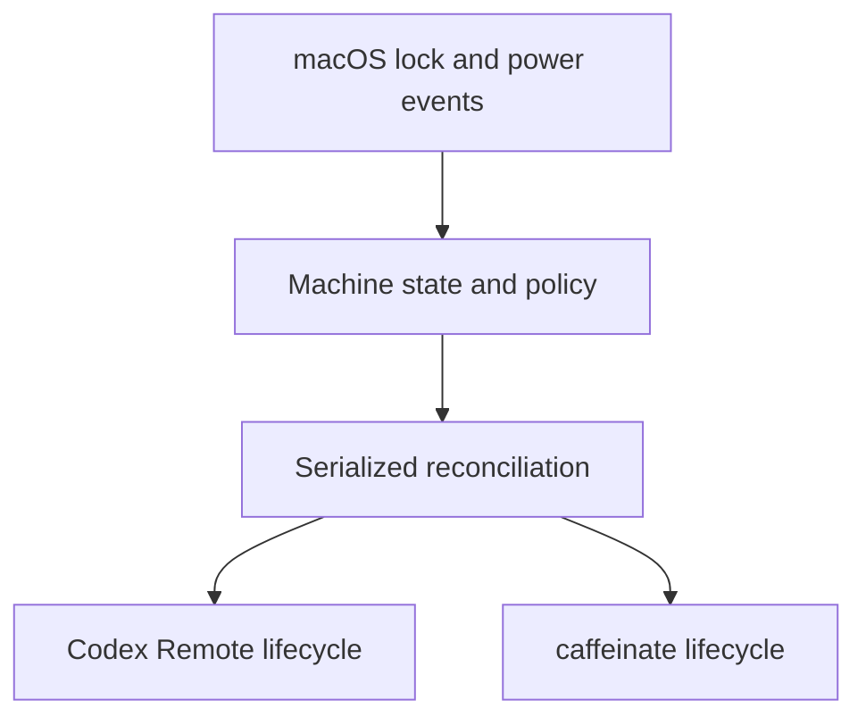

# Codex Away architecture

Codex Away deliberately does not build another Codex client, remote relay,
approval interface, SSH manager, tmux layer, or permanent development server.
OpenAI provides the remote experience; Codex Away manages whether the Mac is
ready to host it.

The listener subscribes to macOS screen-lock, screen-unlock, session, and IOKit
power-source events. It reads the current lock and AC state at startup, then
waits for events rather than polling on a timer.

External commands run asynchronously with bounded output, cancellation, exit
status, and timeouts. Health checks keep observed process state separate from
controller ownership and reject missing, stale, reused, or mismatched process
identities.

For more detail, see [Observed state and ownership](observed-state.md) and
[Reliability acceptance testing](reliability-testing.md).
